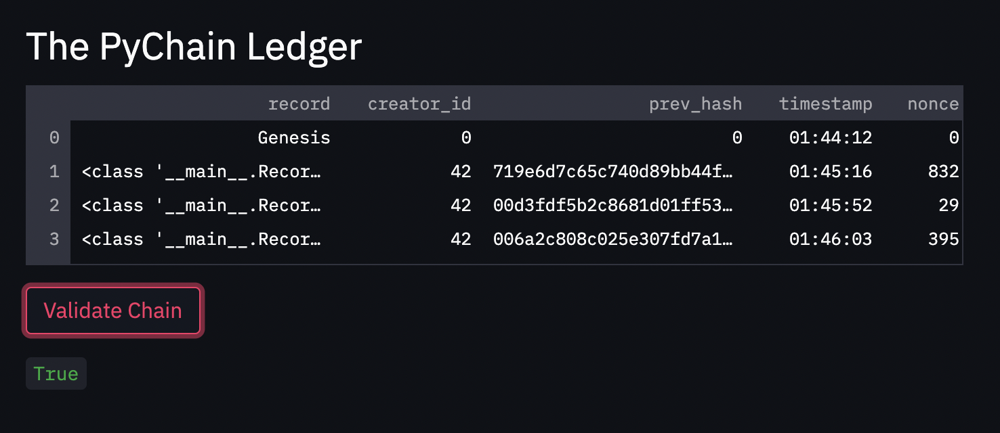
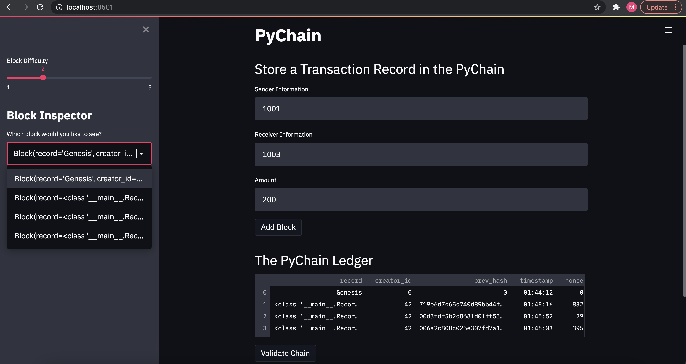

# Going Around the Block-Chain
## Conducting Financial Transactions

This repository is the foundation for a blockchain-based ledger system with a user friendly web interface that allows partner banks to conduct financial transactions. The integrity of the data in the ledger will be able to be verified. To do this we will create a new data class that serves as the blueprint for the financial transaction records that will be stored. We will alter an existing block to include a record attribute. Third, we will create user inputs in the Streamlit application to collect relavant information for each record that we store. Last, we will test the complete PyChain ledger.

---

## Technologies

This project uses Virtual Studio Code and the following python tools/libraries:

- Streamlit: to quickly turn Python scripts into shareable web apps and creating a user-friendly webpage interface for a blockchain.
- Dataclass: to offer ways of defining a custom data structure in Python. We can use a class to store multiple variables, or attributes.
- Proof of Work: a consensus algorithm that blockchain networks commonly use.



_Validity of the Blockchain_

---

## Usage

To succesfully run the python file, please be sure to import the required libraries and dependencies in the python file:

```
import streamlit as st
from dataclasses import dataclass
from typing import Any, List
import datetime as datetime
import pandas as pd
import hashlib
```


_Streamlit Application Page showing Multiple Blocks_


---

## Contributors

Michael Husary was the main contributer along with fellow classmates and the educational staff. 

--- 

## License

N/A
*(Not sure if a license was required on this Challenge)*
